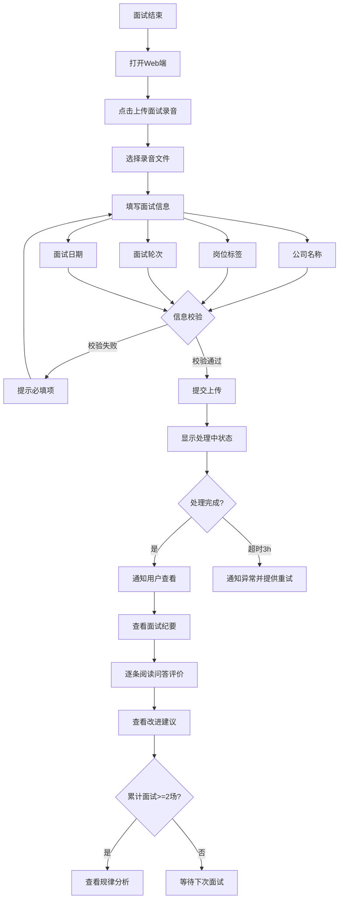
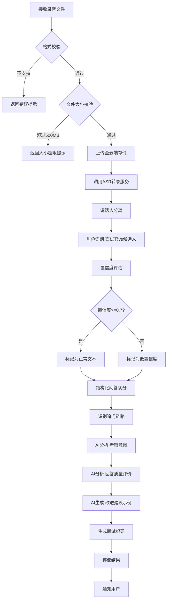
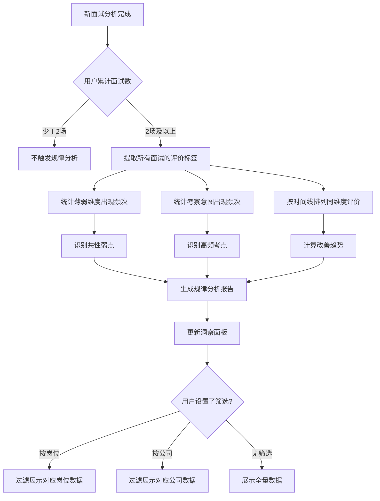
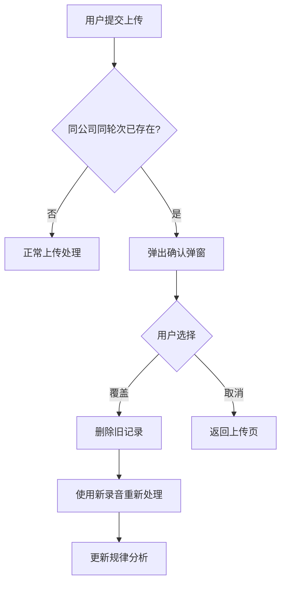

## 面试复盘助手 - 业务流程图

### 1. 核心用户操作流程

```mermaid
flowchart TD
    A[面试结束] --> B[打开Web端]
    B --> C[点击上传面试录音]
    C --> D[选择录音文件]
    D --> E[填写面试信息]
    E --> E1[公司名称]
    E --> E2[岗位标签]
    E --> E3[面试轮次]
    E --> E4[面试日期]
    E1 & E2 & E3 & E4 --> F{信息校验}
    F -->|校验失败| G[提示必填项]
    G --> E
    F -->|校验通过| H[提交上传]
    H --> I[显示处理中状态]
    I --> J{处理完成?}
    J -->|是| K[通知用户查看]
    J -->|超时3h| L[通知异常并提供重试]
    K --> M[查看面试纪要]
    M --> N[逐条阅读问答评价]
    N --> O[查看改进建议]
    O --> P{累计面试>=2场?}
    P -->|是| Q[查看规律分析]
    P -->|否| R[等待下次面试]
```

### 2. 录音处理流程

```mermaid
flowchart TD
    A[接收录音文件] --> B{格式校验}
    B -->|不支持| C[返回错误提示]
    B -->|通过| D{文件大小校验}
    D -->|超过500MB| E[返回大小超限提示]
    D -->|通过| F[上传至云端存储]
    F --> G[调用ASR转录服务]
    G --> H[说话人分离]
    H --> I[角色识别 面试官vs候选人]
    I --> J[置信度评估]
    J --> K{置信度>=0.7?}
    K -->|是| L[标记为正常文本]
    K -->|否| M[标记为低置信度]
    L & M --> N[结构化问答切分]
    N --> O[识别追问链路]
    O --> P[AI分析 考察意图]
    P --> Q[AI分析 回答质量评价]
    Q --> R[AI生成 改进建议示例]
    R --> S[生成面试纪要]
    S --> T[存储结果]
    T --> U[通知用户]
```

### 3. 多轮规律分析流程

```mermaid
flowchart TD
    A[新面试分析完成] --> B{用户累计面试数}
    B -->|少于2场| C[不触发规律分析]
    B -->|2场及以上| D[提取所有面试的评价标签]
    D --> E[统计薄弱维度出现频次]
    E --> F[识别共性弱点]
    D --> G[统计考察意图出现频次]
    G --> H[识别高频考点]
    D --> I[按时间线排列同维度评价]
    I --> J[计算改善趋势]
    F & H & J --> K[生成规律分析报告]
    K --> L[更新洞察面板]
    L --> M{用户设置了筛选?}
    M -->|按岗位| N[过滤展示对应岗位数据]
    M -->|按公司| O[过滤展示对应公司数据]
    M -->|无筛选| P[展示全量数据]
```

### 4. 重复上传处理流程

```mermaid
flowchart TD
    A[用户提交上传] --> B{同公司同轮次已存在?}
    B -->|否| C[正常上传处理]
    B -->|是| D[弹出确认弹窗]
    D --> E{用户选择}
    E -->|覆盖| F[删除旧记录]
    F --> G[使用新录音重新处理]
    G --> H[更新规律分析]
    E -->|取消| I[返回上传页]
```
